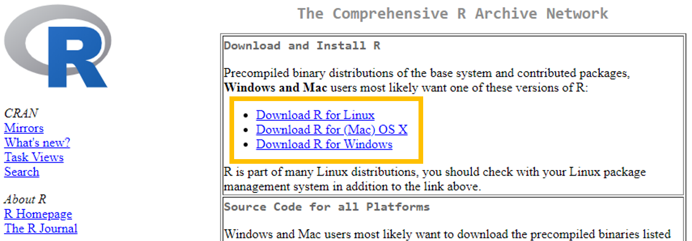

Due Friday, Aug 23 at 11:59pm.

# Welcome

## Meet the TA

{width="300"}

## Overview

-   Today's lab introduces the computing tools we will be using this semester.

-   We will begin by installing R and RStudio, and familiarizing ourselves with its basic functionality.

-   We will also introduce R Markdown as a tool to create high-quality reproducible reports - don't worry, a fillable template is provided.

**This is an individual lab. Your TAs will guide you through the first portion of the lab (until the "On your own" section).**

## Installation

R is a statistical programming language used for computation, data analysis, and graphics generation. It is widely used by statisticians, data scientists, and applied researchers in many fields.

### Benefits of R

-   flexible and freely available to the public, who have in turn written many user-contributed **packages** which provide additional functionality.

-   RStudio is a convenient interface for R that adds convenient features, such as exporting output in nice formats.

-   In this class, we'll be doing all of our computation in RStudio.

Let's begin by installing R and RStudio. First, we need to install R, which can be [downloaded here](https://cran.r-project.org/) (see screenshot below).



Next, install RStudio Desktop, which can be [downloaded here](https://posit.co/download/rstudio-desktop/) (see screenshot below).


## First Steps in RStudio

With R and RStudio installed, we'll begin by exploring RStudio: the interface, reading in data, and basic commands. Upon opening RStudio, you should see something similar to the window below:


The **console** is the panel on the left side, and is where users can type commands and see immediate output. Let's try it out! Type the following code into the console:

```{r echo = T, eval = F}
3 + 5
```

You should get output that looks like

```{r echo = F}
3 + 5
```

(For now, ignore the `[1]`). By typing in `3+5`, we got the expected answer, `8`. We can see that R can be used as a calculator directly in the console. Try some other commands that use R as a calculator. For instance, `3*25`, `exp(2)`, or `(10+5^2)/sqrt(40)`. Of course, R is not simply a calculator; other commands may also be entered here.

To illustrate, let's load a dataset. Enter the following command into the console (you can directly copy/paste it, but make sure everything is exactly as below):

```{r echo = T}
cdc <- read.csv("https://karamccor.github.io/b6002/labs/data/cdc_cleaned.csv")
```

We've just loaded a dataset named `cdc`. These data come primarily from the Sortable Risk Factors and Health Indicators dataset from the CDC, which comprises demographic and health indices compiled from various federal sources. This dataset is now part of our **environment**, which is displayed on the top half and right side of the RStudio window.

-   The environment contains all objects in the current working space. These objects could be variables, lists of variables, or even entire datasets.

-   In the same location as the environment tab, the \*\*history tab displays all commands used during the current session (don't worry about the connections tab for now).

-   Finally, the bottom half of the right-hand panel shows information regarding files on your hard drive, installed packages, output such as plots, and help files or other documents.

Coming back to the dataset we loaded in, we can see that it is named `cdc`. We can take a look at this dataset in a spreadsheet-like window by clicking on `cdc` in the Environment tab to the right, or by running the following code **in the console**:

```{r echo = T}
View(cdc)
```

Note that other objects may be added to the environment, either from external data sources from the internet as in today’s example, datasets downloaded to your computer, or even as created as manipulations of existing datasets.

## R Markdown and reproducible research

R Markdown is a system that may be used to create easy-to-write, attractive reports, presentations, or webpages that also serve as reproducible records of the data analysis. These reports have the desirable property of being able to not only display written narratives and figures, but also include any R code and the outputs from these code snippets.

One of the biggest strengths of R Markdown is that everything is in one place, and that other users should be able to reproduce your results exactly, if they have your R Markdown document and datasets - the analysis is run from the beginning each time you render the document. As well, formatting is easy! Luckily, RStudio already comes with R Markdown support, so there is nothing additional to install.

Every homework assignment and lab in this class will be written in R Markdown, with a template provided for you to use. This lab's template can be downloaded by typing in the following code:

```{r eval = F}
# download.file("https://karamccor.github.io/b6002/labs/lab-01-template.Rmd", destfile="lab-01.Rmd")
```

You should now see the new file `lab-01.qmd` under the Files tab in the bottom-right hand side of your RStudio window. Click on `lab-01.qmd` in this window in order to open it up – it is the template for use in this lab!

First, put your name in the space at the top where it says "YOUR NAME GOES HERE".

Fill in answers in the spaces provided: text narrative should be typed directly in the document and any included R code should be typed inside “chunks,” or sections defined by three backticks (the little mark on the same key as the tilde). See the template for more instructions, or ask your TA.

An important thing to note is that the workspace of the RMarkdown document is separate from the console – this means that you must load any packages inside of R chunks if you want to use functions contained in them. In the template for this lab, this has been done already, but in the future you may have to do it yourself.

In order to turn this template into a shareable document, **Render** the quarto template into an HTML document by pressing the Render button at the top of the document (it is a large blue arrow facing the right). You should see the template rendered as an .html file!

## The tidyverse

-   As mentioned previously, one of the biggest strengths of R is its large userbase who have contributed user-written functions to R via packages. R packages are “add-ons” to the basic functions available in R (think of them as apps on a phone).

-   The `tidyverse` is a collection of packages designed around a common grammar and data structure. Some packages in the tidyverse that we will be using throughout this semester will be `ggplot2`, used for creating graphics and figures, and `dplyr` and `tidyr`, used for data manipulation and wrangling.

First, install the `tidyverse` package by running the following code in your R Studio console:

```{r echo = T, eval = F}
install.packages("tidyverse")
```

After installing the `tidyverse` package, you never have to install it again – all that is needed to use functions from the tidyverse is to load the package once per R session using the following code:

```{r echo = T}
library(tidyverse)
```

Remember that the console and the R Markdown document have different workspaces. If you load the tidyverse package in your console, it won’t be loaded into the workspace for the Quarto document. In the lab template, code for loading the tidyverse has already been provided. However, note that you must have the package installed first.

## Basic Data Manipulation

### Exercise 1

First, let’s take a `glimpse` of the dataset by running the following code **in the console**:

```{r echo = T}
glimpse(cdc)
```

Each row is an *observation* and each column is a *variable*. How many rows and columns does the cdc dataset have? What does each row (observation) represent?

## Physical activity and adult obesity

Today we will be making some basic visualizations using the `ggplot` package in the tidyverse.

In this section we’ll work through a visualization example using the cdc dataset. The variables in this dataset are as follows:

-   `State`, the name of the state

-   `Region`, the US Census region that each state belongs to

-   `HDI`, the Human Development Index of each state in 2017, categorized into whether they are among the top ten, the bottom ten, or the middle

-   `InfantMortalityRate`: infant mortality rate per 100,000

-   `CVDeathRate`: death rate per 100,000 due to cardiovasulcar causes

-   `DrugDeathRate`: death rate per 100,000 due to drug-related causes (ODs, etc.)

-   `MotorDeathRate`: death rate per 100,000 due to motor vehicle-related causes

-   `CancerDeathRate`: death rate per 100,000 due to cancer

-   `Obesity`: % of adults who are obese

-   `Smoking`: % of adults who smoked at least one cigarette in the past month

-   `Exercise`: % of adults who participated in at least 2.5 hours of aerobic activity per week

-   `Seatbelt`: % of adults to regularly wear their seat belt

-   `FluVaccination`: % of adults who received a flu vaccine

-   `ChildVaccination`: % of children who aged 19-35 months who have received the DTaP, polio, MMR, Hib, hepatitis B, varicella and PCV vaccines

-   `Under18`: % of residents under age 18

-   `Over65`: % of residents over age 65

Let’s begin with a very simple plot. Run the following code **in the console**:

```{r echo = T, eval = F}
ggplot(data = cdc, mapping = aes(x = Exercise, y = Obesity)) + 
  geom_point()
```

We just created our first plot in R! Let’s break down what each of these components is. `ggplot()` is the function that tells R to make a plot. We are plotting data from the `cdc` dataset, with `Exercise` on the x-axis and `Obesity` on the y-axis. Adding (`+`) the `geom_point()` in a new layer (separated on a new line for clarity) tells R specifically to create a scatterplot.

Does there appear to be a relationship between the percentage of adults in a state who participate in at least 2.5 hours of aerobic exercise a week and the percentage of adults in that state who are obese? If so, what is this relationship?

Now run the following code:

```{r echo = T, eval = F}
ggplot(data = cdc, mapping = aes(x = Exercise,y = Obesity,color = HDI, shape = HDI)) + 
  geom_point()
```

How does this code differ from the previous snippet? What changes in the scatterplot does this change correspond to?

Finally, run the following code, which should result in the plot below. Pay attention to how we’ve added new layers onto our base plot.

```{r echo = T, eval = T}
ggplot(data = cdc, mapping = aes(x = Exercise, y = Obesity, color = HDI, size = CVDeathRate)) + 
  geom_point() +
  labs(title = "Aerobic Activity vs. Obesity by State HDI", 
       subtitle = "Faceted by Region", 
       x = "Adequate aerobic activity (%)", y = "Obesity (%)") + 
  facet_grid(.~Region) +
  theme_bw()
```

Again, how does this code differ from the previous plot, and what changes in the plot itself correspond to the additional code?

## Exercise 1

How does the HDI of a state relate to the percentage of residents in each state who get 2.5 hours of aerobic activity and who are obese?

# Example Graphs

This section contains the code used to produce the basic graphs in the course slides. Take a moment to examine the similarities and differences between the code examples provided.

-   What is your guess for what each line of code does, given the graphs?
-   What is the aesthetic mapping for each plot?
-   What geometries are being plotted?

```{r echo = T}
ggplot(data = cdc, mapping = aes(x = Region)) + 
  geom_bar(fill = "steelblue") + 
  labs(title = "Number of US States by Census Region", 
       x = "Region", y = "Count")
```

```{r}
ggplot(data = cdc, aes(x = HDI, y = Obesity)) + geom_boxplot()+ 
  labs(title = "Adult Obesity (%) by State HDI", 
       x = "HDI", y = "Adult Obesity (%)")
```

```{r}
ggplot(data = cdc, aes(x = Obesity)) +
  geom_histogram(color = "darkblue", fill = "lightblue", binwidth = 2)+ 
  labs(title = "Distribution of Adult Obesity (%) by State", 
       x = "Adult Obesity (%)", y = "Count")
```

```{r}
ggplot(data = cdc[1:4,], aes(x = State, y = Obesity, group = 1)) +
  geom_line() + 
  geom_point() + 
  labs(title = "Obesity by State", 
       x = "State", y = "Adult Obesity (%)")
```

```{r}
ggplot(data = cdc, mapping = aes(x = Exercise, y = Obesity, color = HDI)) + 
  geom_point() +
  labs(title = "Aerobic Activity vs. Obesity by State HDI", 
       x = "Adequate aerobic activity (%)", y = "Obesity (%)")
```

# Your turn!

In each of the following plots, make sure you have good plot titles and axis labels. Try your best to come up with “active” titles: part of your grade will be based on these considerations!

## Exercise 2

Modify the code used for the bar graph that counts the number of US States by Census Region such that the bars are colored pink.

## Exercise 3

Create a visualization that explores the distribution of adults who smoke among each state. Describe this distribution.

## Exercise 4

Create a visualization that explores the relationship between flu vaccination rate and childhood vaccination rate. What relationship(s) do you see?

## Exercise 5

Create a visualization that explores the relationship between death rate per 100,000 due to cardiovascular causes and the percentage of obese residents in a state. Color-code your plot based on HDI category. What relationship(s) do you see?

## Exercise 6

Create a meaningful visualization of your choice. Comment on the relationship(s) you see.

# From .html to .pdf

As you’ve seen previously, we can **knit** the template into an .html file that can be opened by any web browser. To export it as a .pdf, open the file in your web browser and then print to or save as a .pdf document. Your TA will show you how if you need help! (There is a way to directly knit to a .pdf file, but it’s quite a bit more involved.)

Important: You must turn in a .pdf file corresponding to the R Markdown template to Canvas in order to receive credit for the labs and homework assignments.